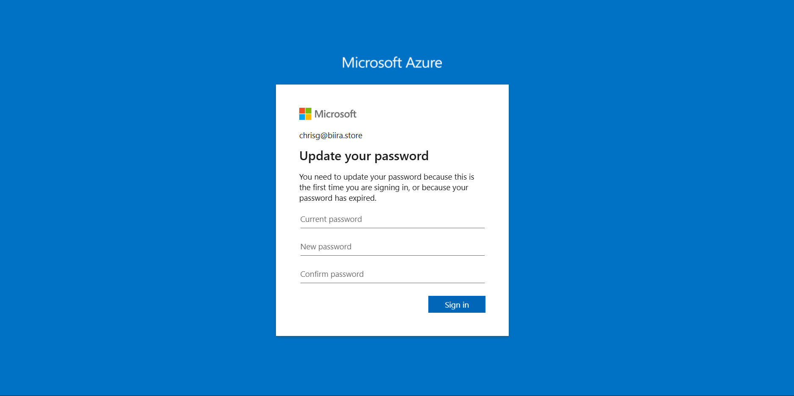

# Identity and Access Management Project: User Setup and Role Testing in Microsoft Entra ID

## Introduction

This project aimed to configure and manage user accounts within a custom domain environment using Microsoft Entra ID (formerly Azure AD). The scope included domain setup, user creation, role assignment, bulk user imports, and license management. By leveraging both the Microsoft Entra admin center and PowerShell, this project demonstrates a comprehensive approach to identity and access management in a cloud-based environment.

## Project Objectives

1. Set up a custom domain for user management
2. Create and configure individual user accounts
3. Assign and test role-based access control
4. Perform bulk user imports using CSV and PowerShell
5. Manage user lifecycle, including deletion and restoration
6. Assign licenses to users for advanced features

## Implementation

### Custom Domain Setup

In this phase, I purchased the domain "biira.store" from GoDaddy and integrated it with Microsoft Entra ID. This involved verifying domain ownership by adding a TXT record to DNS settings and changing the default domain in Microsoft Entra ID to "biira.store".

### Individual User Account Creation

Certainly. I'll expand on the Individual User Account Creation section with more specific details about what you actually did. Here's a revised and expanded version:

### Individual User Account Creation

In this phase, I focused on creating and configuring a user account for Chris Green, a new employee who needed to be set up as an Application Administrator. The process involved several steps to ensure the account was properly created, secured, and had the correct permissions.

First, I logged into the Microsoft Entra admin center using my Global Administrator credentials. From there, I navigated to the "Users" section and selected "New user" to begin the account creation process.

I filled in the following details for Chris Green's account:
- User principal name: ChrisG@biira.store
- Display name: Chris Green
- First name: Chris
- Last name: Green
- Password: I generated a strong, temporary password
- Account enabled: Yes


After creating the account, I proceeded to test the login process. To simulate a first-time user experience, I opened an incognito browser window and navigated to https://portal.azure.com. I entered ChrisG@biira.store as the username and used the temporary password I had set. As expected, the system prompted for a password change on this first login. I set a new, strong password for the account, adhering to the organization's password policy.


Once logged in, I verified that Chris's account was active and functional by checking his ability to access basic portal features.


Next, I assigned the Application Administrator role to Chris. To do this, I returned to the Microsoft Entra admin center and located Chris Green's account in the user list. I clicked on his name to open the user profile, then selected "Assigned roles" from the management options. I clicked "Add assignments" and searched for "Application Administrator" in the role list. After selecting this role, I confirmed the assignment.

To verify the role-specific permissions and access limitations, I logged out of my admin account and logged back in as Chris Green. I then explored various sections of the Microsoft Entra admin center, specifically checking:

1. Enterprise applications: I confirmed that Chris could access this section and view existing applications.
2. App registrations: I verified that Chris had the ability to register new applications.
3. User settings: I checked that Chris couldn't modify global user settings, as this is outside the scope of an Application Administrator.
4. Roles and administrators: I ensured that Chris couldn't assign roles to other users, maintaining the principle of least privilege.


Through these steps, I successfully created Chris Green's account, ensured its security with a password change process, assigned the appropriate role, and verified that the permissions aligned with the Application Administrator role requirements.


### Bulk User Import

#### CSV Method
I downloaded the CSV template from the Microsoft Entra admin center, populated it with information for 10 new accounts, and uploaded it to process the bulk creation job.


### PowerShell Method for User Management

To demonstrate the power and flexibility of automation in user management, I utilized PowerShell with the Microsoft Graph module. This method allows for more granular control and scalability in user creation and management. Here's a detailed breakdown of the process:

#### Setting Up PowerShell Environment

1. I opened PowerShell as an administrator to ensure full access rights.
2. Checked the PowerShell version using `$PSVersionTable.PSVersion`, confirming it was 7.2 or higher as required for optimal compatibility with Microsoft Graph.

#### Installing Microsoft.Graph Module

1. Executed `Install-Module Microsoft.Graph` to install the necessary module.
2. When prompted about installing from an untrusted repository, I confirmed the installation.
3. Verified the installation using `Get-InstalledModule Microsoft.Graph`, ensuring the module was correctly installed and available.

#### Connecting to Microsoft Graph

1. Initiated the connection with `Connect-MgGraph -Scopes "User.ReadWrite.All"`.
2. This opened a browser window where I authenticated using my MOD Administrator account.

3. After successful authentication, I closed the browser and returned to PowerShell.
4. Tested the connection by running `Get-MgUser` to list existing users, confirming successful connectivity.


#### Creating a Password Profile

To streamline user creation, I set up a standard password profile:

```powershell
$PWProfile = @{
    Password = "myPassword1234"
    ForceChangePasswordNextSignIn = $false
}
```

This profile sets an initial password and doesn't force a change on first sign-in, which can be adjusted based on security policies.

#### Adding a New User with PowerShell

I created a new user, Kofi Senam, with specific attributes using the following PowerShell command:

```powershell
New-MgUser `
-DisplayName "Kofi Senam" `
-GivenName "Kofi" `
-Surname "Senam" `
-MailNickname "KofiSenam" `
-UsageLocation "US" `
-UserPrincipalName "kofi.s@biira.store" `
-PasswordProfile $PWProfile `
-AccountEnabled `
-Department "Research" `
-JobTitle "Trainer"
```

This command demonstrates the ability to set various user attributes in a single operation, including:
- Full name and display name
- Email address (UPN)
- Department and job title
- Account status (enabled)
- Initial password settings


Using PowerShell for user management offered several advantages:
1. **Efficiency**: Ability to create users with multiple attributes in a single command.
2. **Consistency**: Ensures all required fields are filled consistently for each user.
3. **Scalability**: This method can be easily adapted for bulk user creation by reading from a CSV file or database.
4. **Automation potential**: The script can be part of a larger onboarding automation process.

### User Lifecycle Management

I deleted the user account for David White in the Entra ID portal, explored the soft delete functionality and 30-day retention policy, and successfully restored David White's account from the Deleted users section.


### License Assignment

I accessed the Microsoft 365 admin portal, located Green's user account, assigned the Microsoft Entra ID P2 license to Green, and verified the license assignment and associated feature access.


## Key Learnings

1. Custom domain integration enhances organizational identity and security
2. Role-based access control is crucial for maintaining least-privilege principles
3. Bulk user management tools significantly improve efficiency in large-scale operations
4. PowerShell automation offers powerful capabilities for user management tasks
5. Soft delete policies provide a safety net for accidental user deletions
6. Proper license assignment is critical for accessing advanced security features

## Conclusion

This project provided hands-on experience with essential identity and access management tasks in Microsoft Entra ID. By utilizing both graphical interfaces and PowerShell automation, we demonstrated the versatility and depth of Microsoft's identity management solutions. The implementation of custom domains, role-based access control, and license management showcases a comprehensive approach to securing and managing user identities in a cloud environment.

The skills developed throughout this project are directly applicable to real-world scenarios, where efficient user management and robust security practices are paramount. As organizations continue to adopt cloud-based solutions, the ability to effectively manage identities, roles, and licenses becomes increasingly critical. This project has laid a solid foundation for further exploration into advanced topics such as Conditional Access, Identity Protection, and Privileged Identity Management (PIM).
