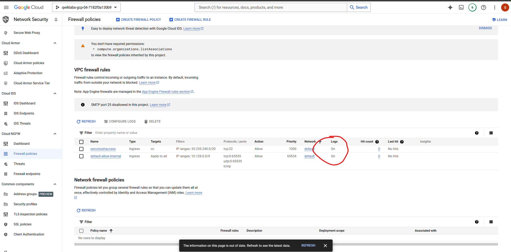

# Cymbal Retail Capstone Project Documentation

## Introduction

Welcome to my capstone project documentation for the Google Cloud Cybersecurity Certificate Program. This project represents a culmination of my learning and hands-on experience in cloud cybersecurity, focusing on the practical application of the skills acquired throughout the course.

As organizations increasingly rely on digital platforms, the importance of robust cybersecurity measures cannot be overstated. The capstone project provides an invaluable opportunity to simulate real-world scenarios that cybersecurity professionals face daily. In this project, I assume the role of a junior cloud security analyst at Cymbal Retail, a prominent retail giant with a substantial global presence. The objective is to navigate the complexities of a data breach incident, employing systematic approaches to identify vulnerabilities, contain the breach, recover affected systems, verify compliance, and remediate any outstanding issues.

Through this documentation, I aim to not only demonstrate my technical competencies but also to share insights and lessons learned during the project. By contributing this project to my GitHub portfolio, I hope to showcase my ability to tackle cybersecurity challenges in a structured and effective manner, making me a strong candidate for future opportunities in the field.

## Overview of Cymbal Retail

Cymbal Retail is a leading retail corporation operating 170 physical stores and an online platform across 28 countries. With reported revenues of $15 billion in 2022 and a workforce of 80,400 employees, the company has established itself as a key player in the global retail market. However, with this growth comes the increasing responsibility to safeguard sensitive customer data and protect against evolving cyber threats.

### The Data Breach Incident

Recently, Cymbal Retail experienced a significant data breach that compromised sensitive customer information and internal systems. This incident not only jeopardizes the company’s reputation but also poses potential financial risks and legal implications. As a junior member of the security team, my role is crucial in supporting the response efforts throughout the lifecycle of this security incident.

### Incident Response Objectives

In addressing the data breach, my primary objectives include:

1. **Identifying Vulnerabilities**: Conduct a thorough analysis to pinpoint the vulnerabilities that contributed to the breach, utilizing various security assessment tools and methodologies.

2. **Isolation and Containment**: Implement immediate measures to isolate the compromised systems and contain the breach, preventing further unauthorized access to sensitive data.

3. **System Recovery**: Collaborate with the security team to recover compromised systems, ensuring the integrity and security of restored operations.

4. **Compliance Verification**: Verify compliance with relevant frameworks and standards, assessing the effectiveness of existing security measures and identifying gaps that need to be addressed.

5. **Remediation of Compliance Issues**: Address any outstanding compliance-related issues to reinforce the company’s security posture and minimize future risks.

By systematically addressing these objectives, I aim to contribute meaningfully to Cymbal Retail’s incident response efforts, fostering a culture of security awareness and resilience within the organization.

### Incident Analysis and Information Gathering

The morning began with the detection of suspicious activity within Cymbal Retail's systems, hinting at a potentially significant security breach. Upon closer examination, it became evident that the breach was extensive, impacting various applications, network segments, systems, and data repositories. Sensitive customer information—including credit card details and personal data—had been exposed, necessitating immediate investigation and a swift, effective response.

#### Leveraging Google Cloud’s Security Command Center

To understand the root causes and scope of the breach, I started by navigating the Google Cloud Security Command Center. Here, my initial focus was on analyzing active vulnerabilities to identify potential entry points exploited by the attackers.

1. **Reviewing Active Vulnerabilities**: The Security Command Center’s "Overview" page provided a summary of current vulnerabilities that required immediate attention. Under the “Findings By Resource Type” tab, I reviewed vulnerabilities organized by resource types, such as storage buckets, compute instances, and firewall configurations. Three resources flagged with high-severity findings included **Bucket**, **Compute.Instance**, and **Firewall**, each critical to securing customer data and system integrity. Recognizing these vulnerabilities was essential for establishing a clear priority list for remediation.
2. 

3. **Compliance Verification**: Next, I accessed the PCI DSS (Payment Card Industry Data Security Standard) report within the Compliance section of the Security Command Center. This report highlighted active findings pertinent to PCI compliance, allowing me to pinpoint gaps that might have contributed to the breach. Sorting findings by severity helped prioritize the most pressing compliance issues, directing my focus on immediate remediation efforts.

### Identifying PCI DSS Compliance Vulnerabilities Related to the Data Breach

### Findings Not Related to Immediate Remediation

In the course of reviewing the report, I identified additional findings that, while still important, were not directly related to immediate remediation efforts for the security breach:

- **Disabled VPC Flow Logs** for certain subnetworks, affecting network traffic visibility.
- **Use of Basic Roles** (Owner, Writer, Reader), which grant broad and excessive permissions.
- **Absence of an Egress Deny Rule** for the monitored firewall, raising concerns over unrestricted outbound traffic.

These findings were acknowledged and documented for future assessment. The focus remained on addressing the high-priority vulnerabilities directly linked to the breach incident, ensuring the most critical risks were analyzed first.

### Findings Analysis and Security Gaps Overview

The Payment Card Industry Data Security Standard (PCI DSS) is a set of security requirements that organizations must follow to protect sensitive cardholder data. Cymbal Retail must ensure compliance with PCI DSS requirements to protect cardholder data. The findings from the PCI DSS 3.2.1 report highlight several vulnerabilities associated with a recent data breach.

| **Findings Category**          | **Rule**                                                                                |
|--------------------------------|------------------------------------------------------------------------------------------|
| Firewall rule logging disabled  | Firewall rule logging should be enabled so you can audit network access                 |
| Open RDP port                   | Firewall rules should not allow connections from all IP addresses on TCP/UDP port 3389  |
| Open SSH port                   | Firewall rules should not allow connections from all IP addresses on TCP/SCTP port 22   |
| Public IP address               | VMs should not be assigned public IP addresses                                          |
| Public bucket ACL               | Cloud Storage buckets should not be anonymously or publicly accessible                  |
| Full API access                 | Instances should not be configured with full access to all Cloud APIs                   |
| Flow logs disabled              | VPC Flow logs should be enabled for every subnet in the VPC Network                     |
| Primitive roles used            | Basic roles (Owner, Writer, Reader) are too permissive and should not be used           |
| Egress deny rule not set        | An egress deny rule should be set                                                       |

   
  

Upon reviewing the findings in the Security Command Center, the vulnerabilities that contributed to the security breach in Cymbal Retail’s environment were categorized by resource type and paired with corresponding compliance rules, exposing significant security lapses. Below is an analysis of each resource type and the critical findings that were observed:

### **Storage Bucket Findings**

1. **Public Bucket ACL**: This finding in the PCI DSS report indicates that the storage bucket has public access control, allowing anyone on the internet to read the data. This exposes sensitive data to unauthorized users, significantly increasing the risk of a data breach.
2. **Bucket Policy Only Disabled**: The absence of an explicit bucket policy controls indicates insufficient restrictions on data access, potentially allowing unauthorized access and data exposure.
3. **Bucket Logging Disabled**: With logging disabled, there is no way to track access to the bucket, making it challenging to monitor or investigate access patterns, particularly in the case of suspicious activity.
 
These findings reflect a severe misconfiguration in bucket-level access controls and monitoring, allowing unauthorized access to sensitive data.

### **Virtual Machine (VM) Instance Findings**

The analysis of the virtual machine `cc-app-01` revealed multiple security vulnerabilities:

1. **Malware Bad Domain**: This finding indicates a low severity threat where a known malicious domain was accessed from the virtual machine. While low severity, this reflects a potential compromise and malicious activity within the instance.
2. **Compute Secure Boot Disabled**: Secure Boot is turned off, leaving the virtual machine vulnerable to unauthorized code execution during startup, which increases the risk of malware infection or system compromise.
3. **Default Service Account Used**: The default service account with high privileges was being used, which exposes the project to higher risk if this account were compromised.
4. **Public IP Address**: Listed in the PCI DSS report, this high-severity finding indicates that the VM is directly accessible from the internet. A public IP exposes the VM to various attacks, increasing the likelihood of a breach.
5. **Full API Access**: The VM has full access to Google Cloud APIs, increasing the risk of unauthorized actions within the environment if the VM were to be compromised.

These VM findings highlight significant misconfigurations, particularly in access control and network exposure, making the VM highly susceptible to attacks.

### **Firewall Findings**

The firewall configuration also exhibited critical vulnerabilities:

1. **Open SSH Port**: The firewall rule allows SSH traffic from any IP on the internet to all instances, a high-severity finding that enables unauthorized access attempts on the network.
2. **Open RDP Port**: Similarly, the firewall rule allows RDP access from all IP addresses, which opens a direct entry point into the environment and leaves instances vulnerable to external attacks.
3. **Firewall Rule Logging Disabled**: Without firewall rule logging, there is no audit trail for allowed or denied traffic, making it difficult to detect or investigate potential access violations.

These firewall findings, all noted in the PCI DSS report, point to insufficient network access restrictions and lack of logging. The configuration exposes the network to unauthorized access, creating a substantial risk of intrusion and data compromise.

### **Summary of Security Gaps**

The vulnerabilities across these resources indicate critical gaps in security configurations and insufficient compliance with PCI DSS requirements. The findings reveal that sensitive customer data was accessible through publicly exposed configurations, lack of access restrictions, and disabled logging, which prevented effective tracking and auditing of access attempts.

### Restoring Security: Remediation of Compute Engine Vulnerabilities

In response to a significant data breach at Cymbal Retail’s cloud environment, which exposed sensitive credit card information and other user data, immediate actions were taken to address the vulnerabilities within the system. A key step in this remediation process involved shutting down the compromised virtual machine (VM), **cc-app-01**, which had been infected with malware. This action was critical to prevent any further exploitation and protect the integrity of the cloud infrastructure.

With the compromised VM shut down, my next task was to create a new VM, **cc-app-02**, utilizing a snapshot taken prior to the malware infection. Leveraging VM snapshots is a best practice for restoring systems to a clean state, effectively eliminating any remnants of malware from the previous instance. I clicked on **Create instance**, designated the name **cc-app-02**, and selected the **e2-medium** machine type, which is classified under the **Shared-core** category, providing a balanced resource allocation for workloads
.

In the **Boot disk** section, I opted to change the settings to utilize the snapshot **cc-app01-snapshot**.
 This selection was crucial in ensuring that **cc-app-02** would not carry over any malware or security vulnerabilities from its predecessor. Additionally, I configured the identity and API access settings, specifically selecting the **Qwiklabs User Service Account** to limit the permissions and reduce potential attack vectors.

To enhance security further, I tagged the network interface with the label **cc**. This tagging was strategically implemented to facilitate the application of targeted firewall rules that would improve the security posture of the VM. The use of network tags allows for granular control over network traffic and ensures that only authorized connections are permitted, thus reducing the risk of unauthorized access.

In the **Networking** section, I opted for **None** under the **External IPv4 address** settings. This decision was made to prevent the assignment of a public IP address to the new VM, further minimizing exposure to external threats and potential attacks.

Once **cc-app-02** was successfully created, I recognized the importance of enabling **Secure Boot** to mitigate a critical security finding regarding secure boot being disabled. To implement this, I temporarily stopped the VM and accessed its settings. In the security section, I enabled the **Turn on Secure Boot** option, which helps to ensure that the VM operates in a secure environment by preventing the execution of unauthorized code during the boot process. After saving these changes, I powered the VM back on, thereby enhancing its security features.

Finally, I returned to the **VM instances** page and proceeded to delete the compromised VM **cc-app-01**. This step was essential for maintaining a secure cloud environment, as it effectively removed the source of vulnerabilities and reinforced the infrastructure against potential threats.

### Fixing Cloud Storage Bucket Permissions

To enhance the security of Cymbal Retail's cloud environment and mitigate the risks associated with unauthorized data access, I focused on the Cloud Storage bucket permissions. The previous vulnerability allowed public access to a bucket containing sensitive data, specifically a file named **myfile.csv** that had been exposed during the data breach.

I began by navigating to the **Cloud Storage > Buckets** section in the Google Cloud console. Upon opening the **Buckets** page, I selected the link to the **project_id_bucket** storage bucket to access the **Bucket details** page. Here, I verified the presence of the sensitive **myfile.csv** file, which was publicly accessible and had been compromised.

To address the **Public bucket ACL** finding, I clicked on the **Permissions** tab. Within the Public access tile, I chose the option to **Prevent public access** and confirmed this action. This step was crucial in revoking public access to the storage bucket, significantly reducing the risk of future data breaches.

Next, I switched the bucket's access control to **uniform bucket-level access**. This configuration enforces a single set of permissions for the bucket and its objects, streamlining permission management and enhancing security. I then proceeded to remove permissions for the **allUsers** principal from the storage bucket. In the **Permissions** section, I meticulously eliminated access for allUsers, ensuring that only authorized users could interact with the data stored within the bucket.

Through these actions, I effectively fortified the security of the Cloud Storage bucket, safeguarding sensitive information and aligning with best practices for data protection in the cloud environment.

### Limiting Firewall Ports Access

To enhance the security posture of Cymbal Retail's cloud environment, I focused on restricting access to RDP and SSH ports. This measure aims to minimize the attack surface and significantly reduce the risk of unauthorized remote access to the virtual machines.

I proceeded with caution, recognizing that overly permissive firewall rules might allow legitimate traffic, and any incorrect modifications could disrupt critical operations. To ensure that the Compute Engine virtual machine instances tagged with the target tag **cc** remained accessible, I created a new firewall rule named **limit-ports but shown as securesshaccess** in the diagram which was change to the limit-ports later. This rule was designed to restrict SSH access exclusively to authorized IP addresses from the Google Cloud Identity-Aware Proxy address range **35.235.240.0/20**.

In creating the firewall rule, I specified the following parameters:
- **Rule Name:** limit-ports
- **Protocol:** TCP
- **Port:** 22 (for SSH)
- **Target Tag:** cc
- **Source IP Range:** 35.235.240.0/20

This configuration ensured that only traffic from the designated IP range could access SSH on instances tagged with **cc**, thus maintaining uninterrupted management access while fortifying the environment against potential unauthorized access.

### Fixing the Firewall Configuration

In my next step, I turned my attention to the overall firewall configuration. I recognized the need to delete three specific VPC firewall rules: **default-allow-icmp**, **default-allow-rdp**, and **default-allow-ssh**. These rules provided unrestricted access to certain network protocols from any source within the VPC network, thereby increasing the potential attack surface.

By deleting these rules, I effectively restricted access to ICMP, RDP, and SSH protocols, creating a more secure and controlled network environment. This action significantly limited the opportunity for unauthorized access attempts, contributing to the overall security enhancement of the infrastructure.

After deleting the aforementioned rules, I proceeded to enable logging on the remaining firewall rules: **limit-ports** (the newly created rule) and **default-allow-internal**. Enabling logging for these rules allows for tracking and analysis of the traffic that is permitted, particularly for internal communications between instances within the VPC.

To enable logging, I accessed the edit option for each firewall rule and activated the logging feature, ensuring continuous monitoring of network activity.

Through these strategic actions, I successfully strengthened the firewall configuration, resulting in a more secure cloud environment while allowing necessary operations to continue uninterrupted.

### Verifying Compliance

In the final phase of addressing the vulnerabilities identified in the PCI DSS 3.2.1 report, I undertook a critical step to verify the effectiveness of the remediation efforts. This involved re-running the compliance report to ensure that the vulnerabilities previously noted had been successfully mitigated and no longer posed a security risk to the environment.

To assess the current status of vulnerabilities, I sorted the findings by clicking on the **Findings** column, which enabled me to display the active findings at the top of the list. I was pleased to observe that all major vulnerabilities had been resolved. The remediation steps taken had effectively addressed the high and medium severity vulnerabilities identified in the earlier assessment.

However, it is worth noting that while the significant vulnerabilities were resolved, the report still indicated that flow logs remained disabled for several subnetworks. This finding persisted due to its relation to the lab environment, which serves as a reminder that continuous improvements in security measures are always necessary.

## Conclusion

Through these diligent efforts, I have successfully assisted the security team at Cymbal Retail in mitigating the impact of the data breach and significantly enhancing the security posture of their Google Cloud environment.

The remediation journey included several critical steps:
- **Vulnerability Assessment:** I meticulously examined and analyzed the vulnerabilities and findings presented in the Google Cloud Security Command Center.
- **VM Management:** The compromised virtual machine (VM) was shut down, and a new VM was created from a snapshot taken prior to the malware infection, restoring system integrity.
- **Cloud Storage Permissions:** I addressed the cloud storage permissions by revoking public access to the storage bucket and transitioning to uniform bucket-level access control. Additionally, I removed all user permissions to further secure the stored data.
- **Firewall Configuration:** I improved the firewall rules by eliminating the overly permissive default-allow-icmp, default-allow-rdp, and default-allow-ssh rules, and enabled logging for the remaining firewall rules to enhance monitoring capabilities.
- **Compliance Verification:** Finally, I ran a compliance report to confirm that the previously identified vulnerabilities had been remediated.

As a security analyst, I recognize the importance of conducting regular security audits and implementing ongoing monitoring practices. This vigilance is essential for maintaining robust protection against evolving threats and vulnerabilities in the ever-changing landscape of cloud security.

For a detailed account of the incident and the steps taken, please refer to the 
[incidence report](<FIles/Incidence Report/Incidence Report.pdf>) I generated.